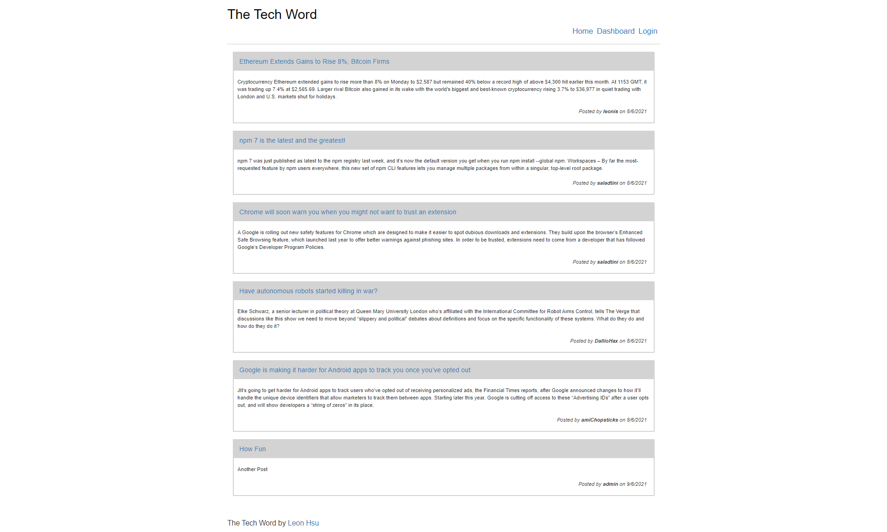
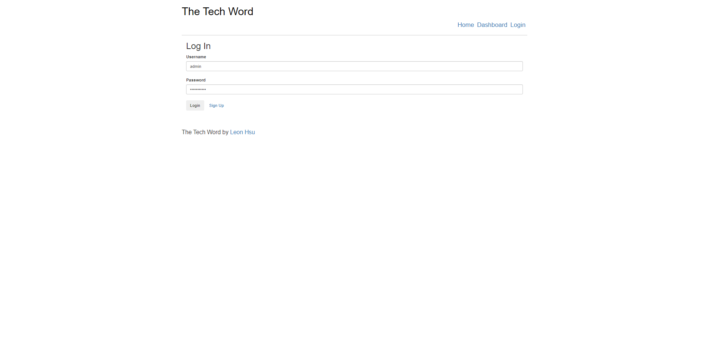
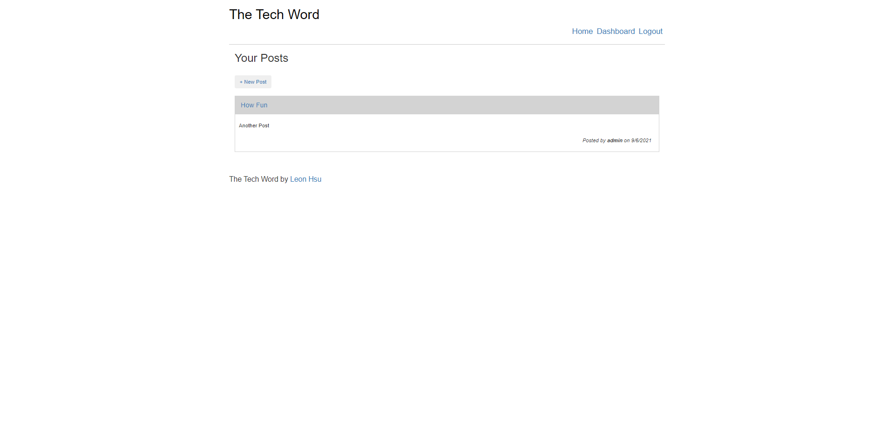
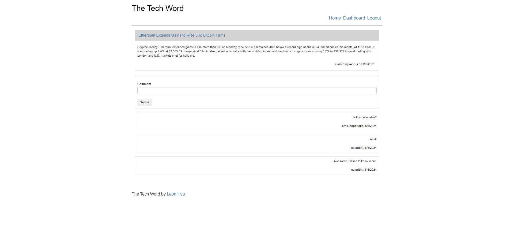
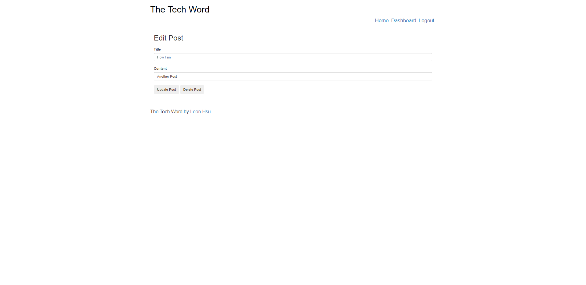

# Tech Blog

Link to the deployed application can be tested here on Heroku: [Tech Blog](https://tech-blog-lh.herokuapp.com/) and the project repository can be viewed here: [Tech Blog](https://github.com/leonhsu95/tech-blog).

Feel free to test by logging in with these credentials:
Username: testUser
Password: 1testUser23?

## Description

This Tech Blog is a CMS style project utilising the MVC structure, routes, SQL and Handlebars templating. In this website, users can view/edit posts, leave comments login and register. Bootstrap is used as the primary CSS styling.

## Table of Contents
- [Installation](#installation)
- [Usage](#usage)
- [Credits](#credits)
- [License](#license)


## Installation

To install the files into your local repo, using Git Bash Terminal:

1) Create a folder locally to nominate for cloning from online repo
2) Clone with SSH by

```GitBash Commands
git clone git@github.com:leonhsu95/tech-blog.git"
 ```

Additionally, please install [NodeJS](https://nodejs.org/en/) and the below npm packages

```Terminal Commands
npm i init -y
npm i
npm i bcrypt
npm i connect-session-sequelize
npm i dotenv
npm i express
npm i express-handlebars
npm i express-session
npm i handlebars
npm i inquirer
npm i mysql2
npm i nodemon
npm i sequelize
 ```

 Before you run the code, please change scripts:{start: } to 'node server.js' in the package.json file and change your database login credentials in the .env file.

 It is highly encouraged to install [Insomnia](https://insomnia.rest/), [MySQL](https://www.mysql.com/products/community/) and [MySQL Workbench](https://dev.mysql.com/downloads/workbench/) for RESTful API and Database functionalities to work.

## Credits

The initial template for the backend is created by University of Sydney and Trilogy Education.
All other codes and functionalities are developed by Leon Hsu [leonhsu95](https://github.com/leonhsu95)

## Usage

The project should look like this:







Usage of this project is subject to the below license.

## License

Copyright 2021 © Leon Hsu [leonhsu95](https://github.com/leonhsu95). All rights reserved.
Licensed under the [MIT](https://opensource.org/licenses/MIT).

Permission is hereby granted, free of charge, to any person obtaining a copy
of this software and associated documentation files (the "Software"), to deal
in the Software without restriction, including without limitation the rights
to use, copy, modify, merge, publish, distribute, sublicense, and/or sell
copies of the Software, and to permit persons to whom the Software is
furnished to do so, subject to the following conditions:

The above copyright notice and this permission notice shall be included in all
copies or substantial portions of the Software.

THE SOFTWARE IS PROVIDED "AS IS", WITHOUT WARRANTY OF ANY KIND, EXPRESS OR
IMPLIED, INCLUDING BUT NOT LIMITED TO THE WARRANTIES OF MERCHANTABILITY,
FITNESS FOR A PARTICULAR PURPOSE AND NONINFRINGEMENT. IN NO EVENT SHALL THE
AUTHORS OR COPYRIGHT HOLDERS BE LIABLE FOR ANY CLAIM, DAMAGES OR OTHER
LIABILITY, WHETHER IN AN ACTION OF CONTRACT, TORT OR OTHERWISE, ARISING FROM,
OUT OF OR IN CONNECTION WITH THE SOFTWARE OR THE USE OR OTHER DEALINGS IN THE
SOFTWARE.

## Features
- Posts are viewable and you can see the author and date of the post created.
- You can freely Login and Sign Up to create new posts.
- All posts made by the author are editable and can be deleted.
- Logged in users can leave comments.


## Tests

This project can be tested with [JS Validation Service](https://jshint.com/). The [Insomnia](https://insomnia.rest/) Design and API Client 
is used to test these functionalities as it can GET, POST, PUT and DELETE Data from the given URL without Front End UI Buttons or Designs.
You will also require [MySQL](https://www.mysql.com/products/community/) and [MySQL Workbench](https://dev.mysql.com/downloads/workbench/) for
this application's database.


